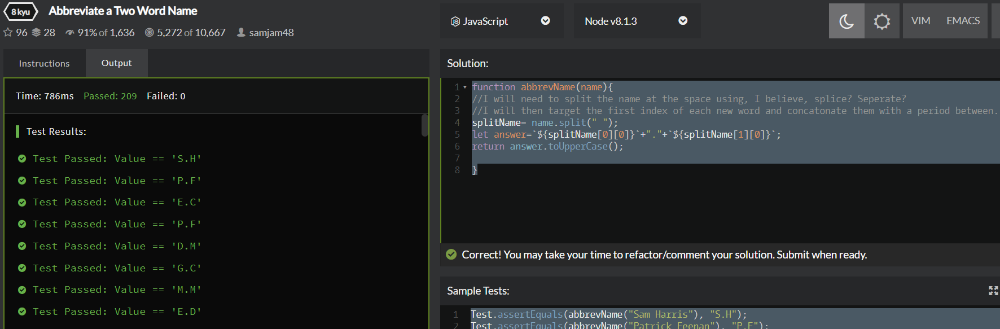

# Code Wars Problem 3.11.19
Prompt:
Write a function to convert a name into initials. This kata strictly takes two words with one space in between them.

The output should be two capital letters with a dot separating them.

It should look like this:

Sam Harris => S.H

Patrick Feeney => P.F

## How It's Made:

ES6, using toUpperCase, split and string interpolation

## Optimizations
It wouldn't have been an optimization but I could have also done this by doing the actual calculation of converting a number to binary. That would be some obnoxious and time consuming math to learn and implement, however, so I'm very glad Javascript has .toString being able to convert numbers as a native function.

## Lessons Learned:

I didn't know .toString could be used to convert numbers to different number-base systems, it's a very useful tool.
