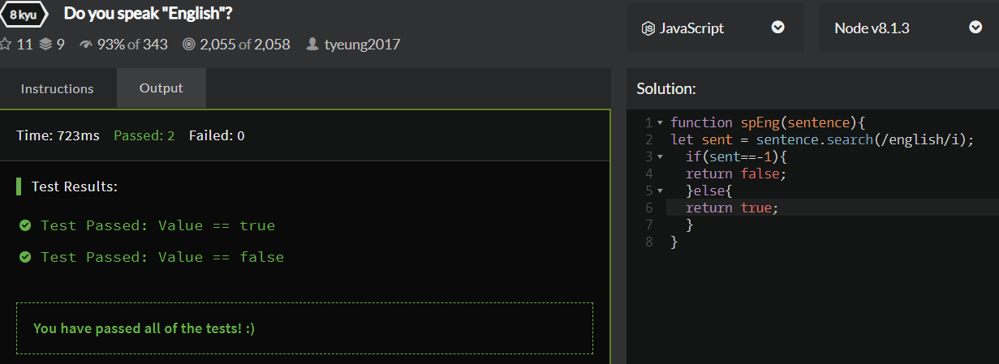

# Code Wars Problem 3.11.19
Prompt:
Given a string of arbitrary length with any ascii characters. Write a function to determine whether the string contains the whole word "English".

The order of characters is important -- a string "abcEnglishdef" is correct but "abcnEglishsef" is not correct.

Upper or lower case letter does not matter -- "eNglisH" is also correct.

Return value as boolean values, true for the string to contains "English", false for it does not.

## How It's Made:

ES6, using toUpperCase, split and string interpolation

## Lessons Learned:

.search method
