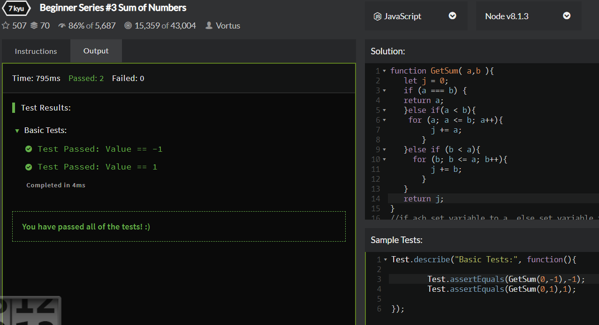

# Code Wars Problem 3.15.19
Prompt:
Given two integers a and b, which can be positive or negative, find the sum of all the numbers between including them too and return it. If the two numbers are equal return a or b.

Note: a and b are not ordered!

## How It's Made:

ES6 using only for loop and conditional

## Optimizations
I could have done this in shorter code if I were more comfortable with arrays and using .sort. Likewise, if I wanted the code to run faster, I could have the for loop moving up and down at the same time, meeting in the middle of the array so that the code executes in half the time.
